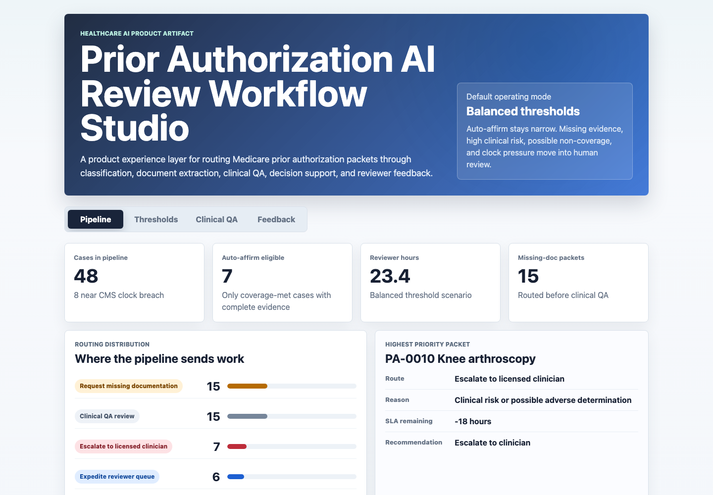
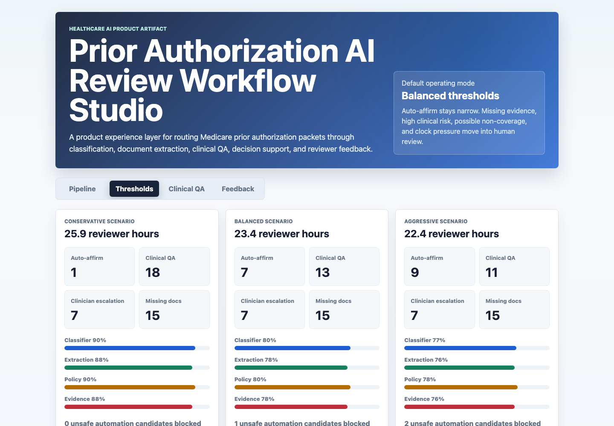
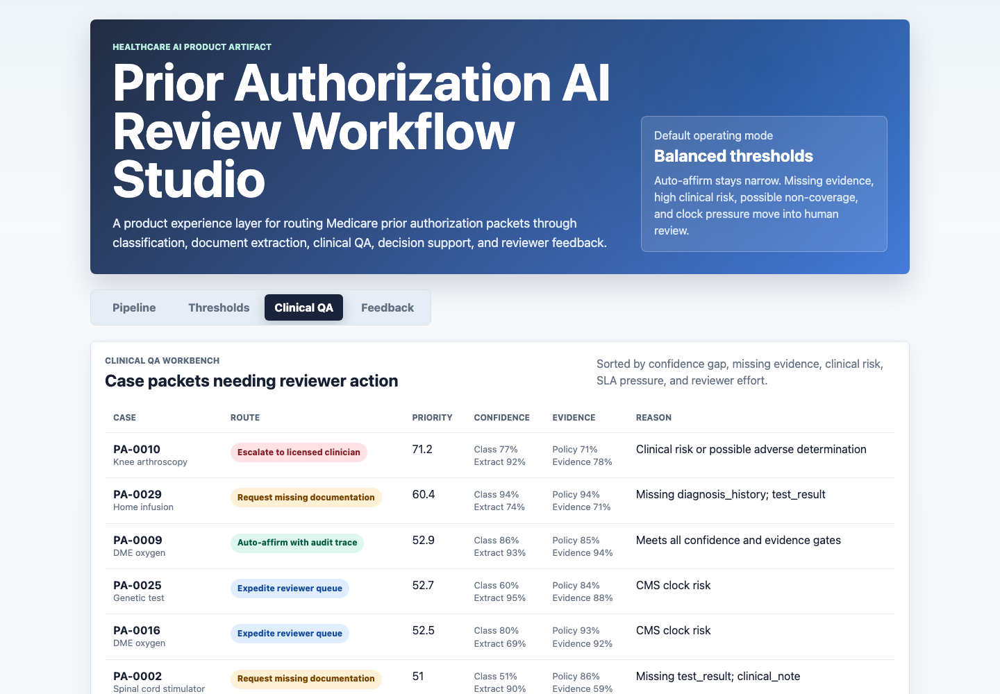
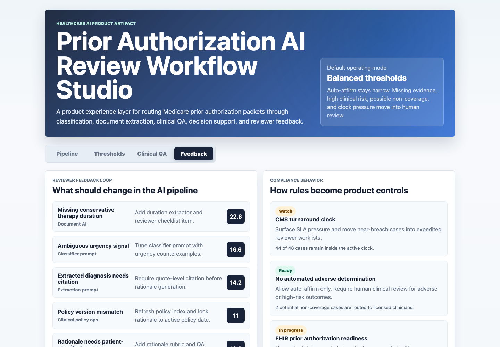

# Prior Authorization AI Review Workflow Studio

An interactive AI product portfolio artifact for a healthcare prior authorization platform team. The studio shows how a product builder can design the experience layer around a probabilistic, multi-model pipeline that classifies requests, extracts document evidence, checks clinical policy fit, routes cases to reviewers, and closes the loop with model and prompt improvements.

## What this project demonstrates

This is not a generic dashboard. It is a product workflow artifact for a regulated healthcare AI use case where the key product question is:

How should confidence thresholds, human review, escalation logic, reviewer feedback, and compliance controls work together before an AI-assisted prior authorization decision is released?

The app is built around four surfaces:

- Pipeline Command Center: stage-level operating health, routing distribution, SLA pressure, and top case risk.
- Threshold Studio: conservative, balanced, and aggressive confidence policies with reviewer load and guardrail impact.
- Clinical QA Workbench: case-level packets with model confidence, extracted evidence sufficiency, route, priority, and escalation reason.
- Feedback and Compliance Loop: reviewer feedback themes, model and prompt remediation actions, CMS clock behavior, human review guardrails, and interoperability readiness.

## Screenshots



Pipeline Command Center. This surface shows how the AI pipeline routes work across auto-affirm, clinical QA, missing-document requests, expedited review, and licensed clinician escalation.



Threshold Studio. This surface compares confidence threshold policies and shows the tradeoff between automation, reviewer hours, escalation, missing documents, and unsafe automation guardrails.



Clinical QA Workbench. This surface turns model output into reviewer-ready case packets with route, confidence, evidence, SLA pressure, and a plain-language escalation reason.



Feedback and Compliance Loop. This surface shows how reviewer notes become prompt, extraction, policy-index, and intake workflow changes while compliance controls stay visible.

## Data strategy

The data is deterministic synthetic data generated for a public portfolio artifact. It does not represent real patients, providers, payer decisions, Medicare cases, clinical documents, utilization management queues, or production model performance.

Real case-level prior authorization packets with clinical evidence, reviewer notes, model confidence, and decision traces are not appropriate for a public portfolio project because they would involve PHI, payer contracts, policy logic, and protected operational data. Synthetic data is the right choice here because the artifact needs to show workflow structure without exposing private healthcare records.

The generator in `scripts/score_operating_data.py` creates 48 PHI-free authorization packets modeled on a prior authorization workflow:

- Procedure category and specialty, including wound care, pain management, orthopedics, sleep medicine, pharmacy, radiology, durable medical equipment, and lab testing.
- Request urgency and CMS-style turnaround pressure, with standard and expedited clocks.
- Intake channel, including FHIR API, X12 278, portal upload, and fax conversion.
- Document packet quality and missing evidence, such as clinical notes, diagnosis history, conservative therapy, test results, and payer policy.
- Pipeline confidence for classification, document extraction, clinical policy matching, evidence sufficiency, and rationale completeness.
- Human review effort, clinical risk, model recommendation, route, escalation reason, and reviewer feedback.

The script uses a fixed random seed so every generated CSV and app payload is reproducible.

## Analysis outputs

- `analysis/outputs/pipeline_summary.json`: app payload with route counts, top cases, threshold scenarios, feedback priorities, and compliance controls.
- `analysis/outputs/threshold_scenarios.csv`: conservative, balanced, and aggressive threshold results.
- `analysis/outputs/clinical_review_queue.csv`: prioritized reviewer worklist.
- `analysis/outputs/feedback_loop_queue.csv`: grouped reviewer feedback themes and remediation owners.
- `analysis/outputs/compliance_readiness.csv`: product controls for CMS clock behavior, human review, audit trace, documentation sufficiency, and interoperability readiness.
- `analysis/executive_findings.md`: concise findings and recommendation.
- `analysis/analysis_plan.md`: reproducible analysis plan.
- `analysis/sql_checks.sql`: SQL-style checks that mirror the generated outputs.

## Role alignment

This artifact demonstrates the work expected from an AI product builder in healthcare:

- Designing confidence thresholds for probabilistic AI output.
- Separating auto-affirm candidates from cases requiring clinical review.
- Avoiding automated adverse decisions by routing potential non-coverage to licensed clinicians.
- Translating regulatory constraints into product behavior.
- Giving reviewers evidence, rationale gaps, and escalation reasons instead of only scores.
- Turning reviewer feedback into model, prompt, policy-index, and intake workflow improvements.
- Working at the boundary between product experience, ML engineering, document AI, healthcare operations, and compliance.

## Scope

This is a static portfolio artifact with a reproducible synthetic data layer. It does not connect to live EHRs, payer portals, FHIR servers, X12 gateways, clinical policy engines, LLM APIs, human review systems, or production utilization management workflows. It does not make clinical decisions and it does not process PHI.

What it does show is the product thinking and operating logic needed before building or scaling a healthcare AI prior authorization workflow: threshold design, human-in-the-loop routing, reviewer experience, audit trace needs, compliance behavior, and feedback loops.

## Run locally

```bash
npm run analyze
npm start
```

Then open `http://localhost:4173`.
